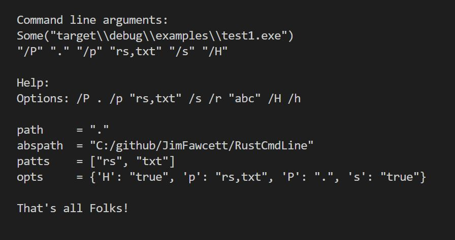

# RustCmdLine Repository

## Parse console command line arguments

Last Modified: 11/25/2022

<!--  -->

## Quick Status

- Version: 1.1.0
- Code status\*\*: No known defects
- Demonstration code: yes
- Documentation: yes
- Test cases: coming soon
- Static library: yes
- Build requires: Rust installation
- Planned design changes\*\*: Many


# Concept

<!--  -->

* Fgure 1. CmdLineParser Output


RustCmdLine is a facility for parsing command line arguments. Here's a sample:
```
/P "." /p "rs,txt" /s /H /r "abc"
```
where:
```
/P "."          - path
/p "rs,txt"     - file patterns
/s              - recurse through directory tree rooted at path
/H              - hide directories that don't contain target files
/r "abc"        - regular expression
```

The intent is that a program creates an instance of CmdLineParser, uses that to parse its command line, then passes it to any code that needs to know about an option.

## Design

This repository contains a library with a single user-defined type: CmdLineParser. It contains a vector of pattern strings (file extensions), a HashMap of option char and value, e.g., {P, "."}, and a help string. It provides methods for initiating the parse, returning pattern strings, returning options, and returning the path.

CmdLineParser implements the following methods and functions:

1. new() -> Self  
&nbsp;&nbsp;Create new `CmdLineParser` which has an options hashmap, patterns vector, and help string.

2. parse(&self)  
&nbsp;&nbsp;Builds internal options hashmap and patterns vector.

3. path(&self) -> String  
&nbsp;&nbsp;Return value of relative root path, held in options map.

4. abs_path(&self) -> String
&nbsp;&nbsp;Return value of absolute root path, from canonicalized relative path.

5. set_path(&mut self, p:&str)  
&nbsp;&nbsp;Replaces value of root path, held in options map.

6. set_regex(&mut self, re:&str)  
&nbsp;&nbsp;Replaces value of regex string, held in options map.

7. get_regex(&mut self) -> &str
&nbsp;&nbsp;Retrieves value of regex string, held in options map.

8. default_options(&mut self)  
&nbsp;&nbsp;Sets values of some of the options in options map.

9. contains_option(&self, opt:char) -> bool
&nbsp;&nbsp;Returns true if options map contains key opt, else returns false.

10. add_option(&mut self, opt:char, val:&str)
&nbsp;&nbsp;Inserts option in options hashmap, adding key if it does not exist, else overriding previous value.

11. value(&self, opt:char) -> &str  
&nbsp;&nbsp;Inserts option in options hashmap, adding key if it does not exist, else overriding previous value.

12. add_pattern(&mut self, patt:&str) -> &mut self
&nbsp;&nbsp;Inserts patt into patterns vector. Method can be chained.

13. patterns(&self) -> &CmdLinePatterns  
&nbsp;&nbsp;Returns reference to vector of patterns.

14. options(&self) -> &Options  
&nbsp;&nbsp;Returns reference to hashmap of options.

15. help(&self) -> &str  
&nbsp;&nbsp;Returns default help string.

16. replace_help(&mut self, hs:&str)  
&nbsp;&nbsp;Replace internal help string.


## Operation

See Test1.rs in examples folder for typical usage.


## Build

Download and, in a command prompt, `cargo build` or `cargo run`.


## Status

This is version 1.1.0  

Tested on both Windows 10 and Ubuntu Linux


